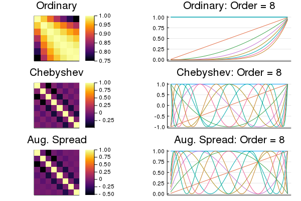
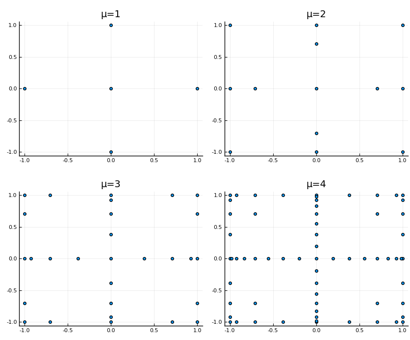
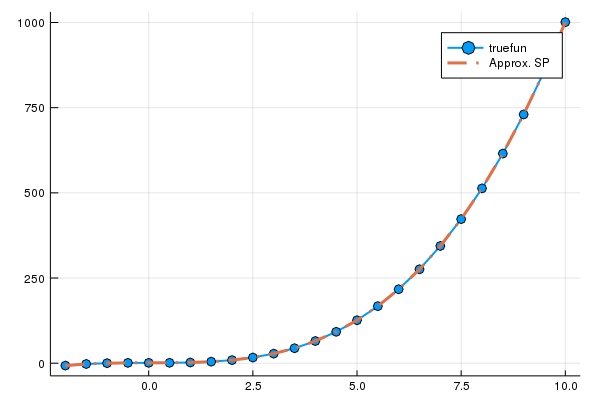

[](https://coveralls.io/github/alancrawford/Smolyak?branch=master)
## Description

This module contains code to define Smolyak polynomials, basis functions and grids. 

The Smolyak algorithm provides and efficient way to construct multivariate function approximations. The accuracy of the approximation in each dimension of the state vector is linked to the 'level'. In an isotrophic Smolyak polynomial the level is the same for all dimensions of the state vector. Anisotrophic Smolyak polynomials allow the user to vary the accuracy of the interpolating polynomial in each dimension by specifiying a dimension specific level. 

Crudely put, a higher level of accuracy corresponds to interpolating higher order basis functions in each dimension. The cost of this is computational expense of computing more tensor products in the approximating polynomial. 

However, using the Smolyak algorithm ensures that the number of tensor products increase at a polynomial - rather than exponential - rate linked the level of accuracy chosen by the user. Therefore they are very effective at mitigating the curse of dimensionality.

Both Anisotrophic and Isotrophic Grids/Polynomials are supported and are constructed efficiently following the methodology outlined in Judd, Maliar, Maliar, Valero (2014). 

Moreover, the package allows the user to choose the univariate basis function type: ordinary, chebyshev and an augmented version of spread polynomials are available. 

The figure below shows correlation between basis function on the left and the basis functions up to order 8.



Chebyshev polynomials have many benefits over ordinary polynomials (i.e. low correlation of basis functions). However, unlike ordinary polynomial they are not - unlike ordinary polynomials - inherently sparse. This is unlikely to be costly in many applications. However, when sparsity is important the user might like to use spread polynomials. 

The augmented spread polynomials are a translated version of chebyshev polynomials. Therefore they share some key benefits of Chebyshev polynomials, and they are - like ordinary polynomials - inherently sparse. 

The code is designed for Julia version: 0.7/ 1.0.

The module is designed around a `SmolyakKernel` type. It contains all information necessary to construct the 3 main Smolyak outputs:

- `SmolyakGrid` : Smolyak Grid
- `SmolyakBasis` : Smolyak Basis
- `SmolyakPoly` : Smolyak Polynomial

# Usage

Below is an example of how to use the module to:

1. Create a SmolyakKernel type
2. Create a Smolyak Grid
3. Create, evaluate and query a Smolyak polynomial
4. Fit a Smolyak polynomial
5. Interpolation 

## 1. SmolyakKernel type

```
using Smolyak

# Accuracy levels and bounds on x variables
mu = [2,2]
xbnds = [[-2. , 3.] for d in 1:length(mu)]

# Create a Smolyak Kernel 
sk = SmolyakKernel(mu, xbnds);
```

Using the SmolyakKernel to create Smolyak Grids and Polynomials.

## 2. Smolyak grids

```
# Create Smolyak grid corresponding to Smolyak Kernel above
sg = SmolyakGrid(sk);

# View the vector of grid points
sg.grid

# View the vector of grid points in x-coordinates
x(sg.grid)

# Convert grid from vector of vectors to a matrix (i.e. for plot)
grid = VVtoMatrix(sg.grid)
```

See [SmolyakGridExample.jl](./Examples/SmolyakGridExample.) for plots of 2-dimensional Smolyak Grids. 



## 3. Create, evaluate and query a Smolyak Polynomial

Smolyak polynomials require a `SmolyakBasis`. 

The `SmolyakBasis` contains all of the information necessary to apply Smolyak algorithm to tensors of a chosen type of polynomial basis functions. The available options for the type of basis functions are `:ordinary`, `:chebyshev`, or `:spread` polynomials. 

The `SmolyakBasis`  can be built using the `SmolyakKernel` or by specifying the accuracy levels and variables bounds directly. I show the former below.

```
# Choose type of polynomial basis function
basis_fun_type = :chebyshev;
```

Initiate the Smolyak Polynomial - with memory allocated for up to 2 derivatives. Of course, to save space in memory the user can choose not to allocate memory for the gradient and hessian fields by setting `NumDeriv=0` (or omit memory for hessian only by setting `NumDeriv=1`). 

- Option 1: Instantiate the Smolyak polynomial using Smolyak basis formed using the Smolyak kernel, `sk` defined above.

```
sb = SmolyakBasis(basis_fun_type, sk; NumDeriv=2);
sp = SmolyakPoly(sb; NumDeriv=2);
```

- Option 2: Instantiate the Smolyak polynomial using Smolyak kernel, `sk`, directly

```
sp = SmolyakPoly(basis_fun_type, sk; NumDeriv=2);
```

Once intialised input/update coefficients and update Smolyak polynomial. 

```
θ = rand(length(sp.sb.BF));
coef!(θ, sp);
```

Or update the state vector.

```
# Evaluate a new state: update Smolyak polynomial at stored θ
x = [-1.0, 2.3];
state!(x, sp);
```

The Smolyak polynomial can be evaluated at the stored state, `sp.sb.x`, and coefficients, `sb.coef`. The user can choose to calculate the value, gradient and hessian and store the results in updated fields using:

```
# Update the value
value!(sp)
gradient!(sp)
hessian!(sp)

# Print updated fields
sp.value
sp.gradient
sp.hessian
```

Or to update value, gradient and hessian at once:

```
# Update value
SmolyakPoly!(sp; NumDeriv=0)

# Update value and gradient
SmolyakPoly!(sp; NumDeriv=1)

# Update value, gradient and hessian
SmolyakPoly!(sp; NumDeriv=2)
```

Alternatively, the user can assign the value, gradient and hessian at a new state, `x`  given `sp.coef`

```
x = [-1.3 , 0.78]
W = value(x, sp)
∇W = gradient(x, sp)
∇2W = hessian(x, sp)

# Or by calling
W = SPoutput(x, sp; NumDeriv=0);
(W, ∇W) = SPoutput(x, sp; NumDeriv=1);
(W, ∇W, ∇) = SPoutput(x, sp; NumDeriv=2);
```

Individual components of the gradient and hessian can also be calculated directly.

```
# Derivative of Smolyak polynomial wrt. to dimension d_i
d_i = 1;
∇W_1 = dWdx(sp, d_i)

# Cross derivatives wrt. to dimensions [d_i,d_j]
d_i = 1;
d_j = 2;
∇2W_12 = d2Wdx2(sp, d_i, d_j)
```

## 4. Fitting a Smolyak polynomial

Suppose we have a one dimensional function to approximate 

```
truefun(x) = 1.1 + x[1]^3
xbnds = [[-2.0, 10.0]
```

Suppose we wish to use a Smolyak Polynomial with Spread polynomial basis function and an accuracy level 3 dimenison to approximate this function on x = [-2.0, 10.0].

```
# Intiate Smolyak Components
dims = 1;
accuracy = 3;
xbnds =  [[-2.0, 10.0]]; # xbnds::VV{T} where T<:Real 
sk = SmolyakKernel(dims, accuracy, xbnds);
sp = SmolyakPoly(:spread, sk; NumDeriv=0);
```

In this example, we will use the grid points of the corresponding Smolyak grid to evaluate the true function and use it fit coefficients.

```
# Get true values of function at grid points
sg = SmolyakGrid(sk);

# Generate corresponding Smolyak Basis Functions
BF = VVtoMatrix(BasisFunctions(xgrid(sg), sp.sb)); 

# Get values of truefun at Smolyak grid points
W = truefun.(xgrid(sg));

# Solve for the coefficients
θ = BF\W
```

## Interpolation

Next the function above is interpolated on its domain.

```
# First update SmolyakPoly type coefficient field
coef!(θ, sp)

# Points to evaluate the function and its approximation on 
xpts = collect(-2.0:0.5:10.0;);

# Interpolate
What = value([[x] for x in xpts], sp);
```

_Note: The argument passed to `value` must be a vector of vectors. Vectors or matrix can simply be placed a comprehension as in the exmaple above._

To illustrate the interpolation plot `truefun` against its approximation.

```
# Plot the results
using Plots
plot(xpts, truefun.(xpts), w=2, marker=(:o,4), label=truefun)
plot!(xpts, What, w=3, line=:dashdot, label="Approx. SP")
```



Examples of multi-dimensional interpolation can be found in [runtests.jl](./test/runtests.jl).
