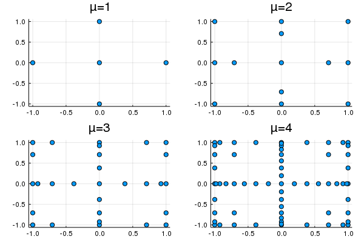

[](https://coveralls.io/github/alancrawford/Smolyak?branch=master)
## Description

This module contains code to define Smolyak polynomials, basis functions and grids. 

The Smolyak algorithm provides and efficient way to construct multivariate function approximations. The accuracy of the approximation in each dimension of the state vector is linked to the 'level'. In an isotrophic Smolyak polynomial the level is the same for all dimensions of the state vector. Anisotrophic Smolyak polynomials allow the user to vary the accuracy of the interpolating polynomial in each dimension by specifiying a dimension specific level. 

Crudely put, a higher level of accuracy corresponds to interpolating higher order basis functions in each dimension. The cost of this is computational expense of computing more tensor products in the approximating polynomial. 

However, using the Smolyak algorithm ensures that the number of tensor products increase at a polynomial - rather than exponential - rate linked the level of accuracy chosen by the user. Therefore they are very effective at mitigating the curse of dimensionality.

Both Anisotrophic and Isotrophic Grids/Polynomials are supported and are constructed efficiently following the methodology outlined in Judd, Maliar, Maliar, Valero (2014). 

Moreover, the package allows the user to choose the univariate basis function type: ordinary, chebyshev and an augmented version of spread polynomials are available. 

Chebyshev polynomials have many benefits over ordinary polynomials. However, unlike ordinary polynomial they are not - unlike ordinary polynomials - inherently sparse. This is unlikely to be costly in many applications. However, when sparsity is important the user might like to use spread polynomials. 

The augmented spread polynomials are a translated version of chebyshev polynomials. Therefore they share some key benefits of Chebyshev polynomials (i.e. low correlation of basis functions), and they are - like ordinary polynomials - inherently sparse. 

The code is designed for Julia version: 0.7/ 1.0.

The module is designed around a `SmolyakKernel` type. It contains all information necessary to construct the 3 main Smolyak outputs:

- `SmolyakGrid` : Smolyak Grid
- `SmolyakBasis` : Smolyak Basis
- `SmolyakPoly` : Smolyak Polynomial

## Example

Below is an example of how to use module to:

1. Create a Smolyak Kernel
2. Create and evaluate the Smolyak polynomial

```
using Smolyak

# Accuracy levels and bounds on x variables
mu = [2,2]
xbnds = [[-2. , 3.] for d in 1:length(mu)]

# Create a Smolyak Kernel 
sk = SmolyakKernel(mu, xbnds);
```

Using the SmolyakKernel to create Smolyak Grids and Polynomials.

# Creating a Smolyak grid

```
# Create Smolyak grid corresponding to Smolyak Kernel above
sg = SmolyakGrid(sk);

# View the vector of grid points
sg.grid

# View the vector of grid points in x-coordinates
x(sg.grid)

# Convert grid from vector of vectors to a matrix (i.e. for plot)
grid = VVtoMatrix(sg.grid)
```

See [SmolyakGridExample.jl](./Examples/SmolyakGridExample.) for plots of 2-dimensional Smolyak Grids. 



# Creating a Smolyak Polynomial

Smolyak polynomials require a `SmolyakBasis`. 

The `SmolyakBasis` contains all of the information necessary to apply Smolyak algorithm to tensors of a chosen type of polynomial basis functions. The available options for the type of basis functions are `:ordinary`, `:chebyshev`, or `:spread` polynomials. 

The `SmolyakBasis`  can be built using the `SmolyakKernel` or by specifying the accuracy levels and variables bounds directly. I show the former below.

```
# Choose type of polynomial basis function
basis_fun_type = :chebyshev;
```

Initiate the Smolyak Polynomial - with memory allocated for up to 2 derivatives. Of course, to save space in memory the user can choose not to allocate memory for the gradient and hessian fields by setting `NumDeriv=0` (or omit memory for hessian only by setting `NumDeriv=1`). 

- Option 1: Setup Smolyak polynomial using Smolyak basis formed using the Smolyak kernel, `sk` defined above.

```
sb = SmolyakBasis(basis_fun_type, sk; NumDeriv=2);
sp = SmolyakPoly(sb; NumDeriv=2);
```

- Option 2: Setup Smolyak polynomial using Smolyak kernel, `sk`, directly

```
sp = SmolyakPoly(basis_fun_type, sk; NumDeriv=2);
```

Once intialised input/update coefficients and update Smolyak polynomial. 

```
θ = rand(length(sp.sb.BF));
SmolyakPoly!(θ, sp; NumDeriv=2);
```

Or update the state vector an recalculate value, gradient and hessian.

```
# Add a new state: update Smolyak polynomial at stored θ
x = [-1.0, 2.3];
SmolyakPoly!(x, sp; NumDeriv=2);
```

Or update both the state and coefficient vector:

```
# Add a new θ  & x: update Smolyak polynomial
θ = rand(length(sp.sb.BF));
x = [-1.0, 2.3];
SmolyakPoly!(θ, sp, x; NumDeriv=2);
```

_Note: In the above calls if NumDeriv=2, this will update the value, gradient and hesssian/ If NumDeriv=1 the value and gradient are updated. If NumDeriv=0, only the value is updated._

After the update the updated fields are:

```
# Print updated fields
sp.value
sp.gradient
sp.hessian
```

The user can also get update the coefficient or state vector separately. 

```
# Update Coefficient
coef!(θ, sp);

# And/or update state vector & update basis fucntions
state!(sp, x);
SmolyakBasis!(sp.sb);
```

Then calculate the value, or specific component of the gradient and hessian using:

```
# Value of smolyak polynomial at new state / θ 
value(sp)

# Derivative of Smolyak polynomial wrt. to dimension d_i
d_i = 1;
dWdx(sp, d_i)

# Cross derivatives wrt. to dimensions [d_i,d_j]
d_i = 1;
d_j = 2;
d2Wdx2(sp, d_i, d_j)
```


Further examples can be found in [Interpolation Example](./Examples/Interpolation_Example.jl).